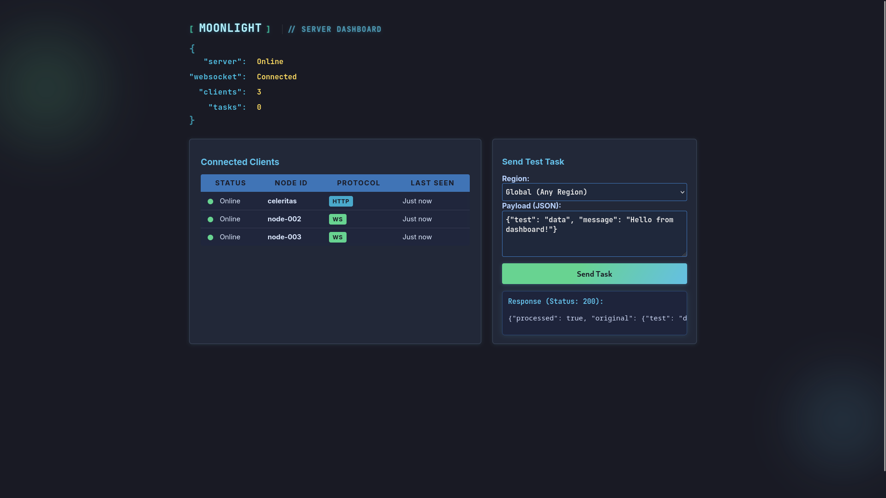

## Moonlight Server 🌙

<p align="center">
  
</p>


A lightweight HTTP JSON proxy that selects a registered client by region and forwards your payload, returning the client's response as-is. Supports both HTTP and WebSocket communication with a modern web dashboard for monitoring and management.

### Features
- Token-gated client registration with secure authentication
- Region-aware client selection with hierarchical fallback
- Simple load balancing by recency and latency
- Server-assigned job IDs for task tracking
- Payload-only proxy: only `payload` is sent to the client
- WebSocket support for real-time communication
- Automatic fallback from WebSocket to HTTP if needed
- Modern web dashboard with real-time monitoring
- Dynamic region selection via API endpoint

### Quick Start
```bash
make build
./build/moonlight-server
# or
make run
```

Copy config to the default path:
```bash
sudo mkdir -p /etc/moonlight
sudo cp mls.json /etc/moonlight/mls.json
```

The server listens on `:8080` by default.

### Configuration
Minimal `/etc/moonlight/mls.json`:
```json
{
  "tokens": ["supersecrettoken1"],
  "retry_count": 3,
  "port": 8080,
  "ws": {
    "enabled": true,
    "path": "/ws",
    "max_connections": 1000,
    "read_timeout": 300,
    "write_timeout": 30,
    "heartbeat_interval": 30,
    "connection_check_interval": 60
  },
  "html": {
    "enabled": true,
    "static_path": "/static",
    "index_path": "/",
    "dashboard_path": "/dashboard"
  },
  "region_hierarchy": {
    "us-east-1": "usa",
    "us-west-2": "usa",
    "usa": "northamerica",
    "northamerica": "global"
  }
}
```


### HTTP API
All endpoints use/return JSON.

- **POST `/client/heartbeat`** - Register client
- **POST `/task/request`** - Submit task for processing
- **GET `/clients/table`** - Get connected clients list
- **GET `/region`** - Get available regions list

### WebSocket API
Connect to `ws://server:port/ws` for real-time communication.

#### Message Types

**Client Registration:**
```json
{
  "type": "register",
  "payload": {
    "ip": "1.2.3.4",
    "node_id": "node-1", 
    "token": "supersecrettoken1",
    "region": "us-east-1",
    "port": 3000
  }
}
```

**Heartbeat:**
```json
{
  "type": "heartbeat",
  "payload": {
    "timestamp": "2024-01-01T12:00:00Z"
  }
}
```

**Task (from server to client):**
```json
{
  "type": "task",
  "task_id": "abc123",
  "payload": {"any": "json"}
}
```

**Task Response (from client to server):**
```json
{
  "type": "task_response",
  "payload": {
    "task_id": "abc123",
    "response": {"result": "data"},
    "status": 200,
    "headers": {"Content-Type": "application/json"}
  }
}
```

### Web Dashboard

<p align="center">
  
</p>

When HTML is enabled, the server provides a modern web dashboard with:

Access at `http://server:port/` or `http://server:port/dashboard`

### Clients

#### Node.js WebSocket Client
```bash
cd clients/js
npm install
node websocket-client.js
```

#### Python WebSocket Client
```bash
cd clients/python
pip install -r requirements.txt
python websocket-client.py
```

#### Node.js HTTP Client (Legacy)
```bash
cd clients/js
node node-client.js
```

#### Client Configuration
Set environment variables for client configuration:
```bash
export MLS_HOST=localhost
export MLS_PORT=8080
export MLS_TOKEN=supersecrettoken1
export MLS_REGION=us-east-1
export MLS_NODE_ID=my-node-1
export CLIENT_PORT=3000
```


### Notes
- "global", "default", or empty region match any client
- If multiple clients match, the most recently seen with lowest latency is preferred

